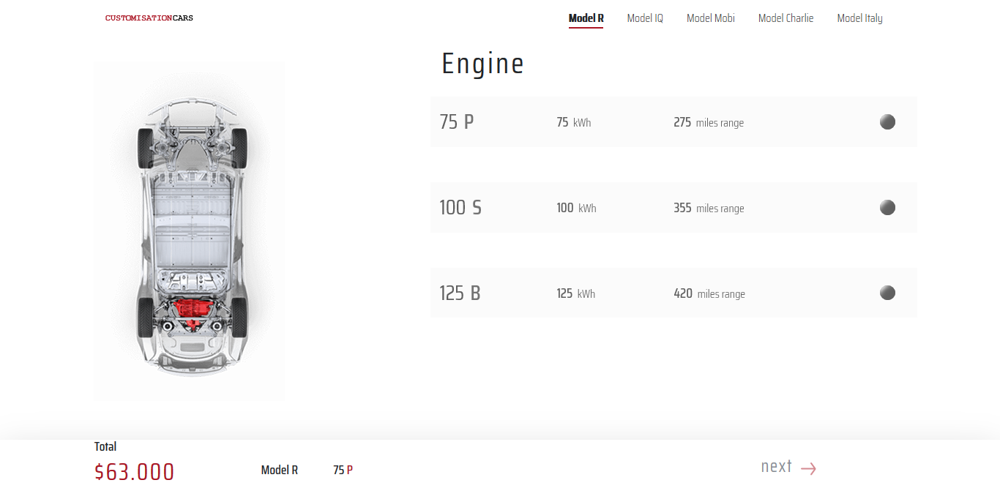
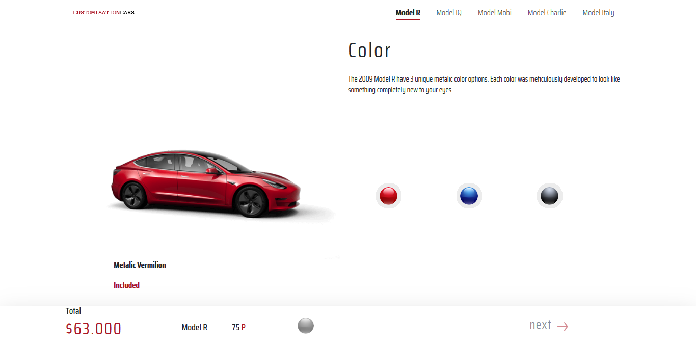
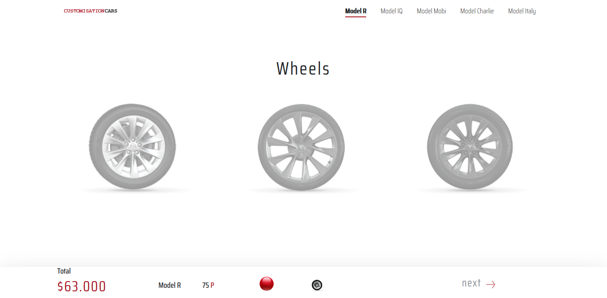
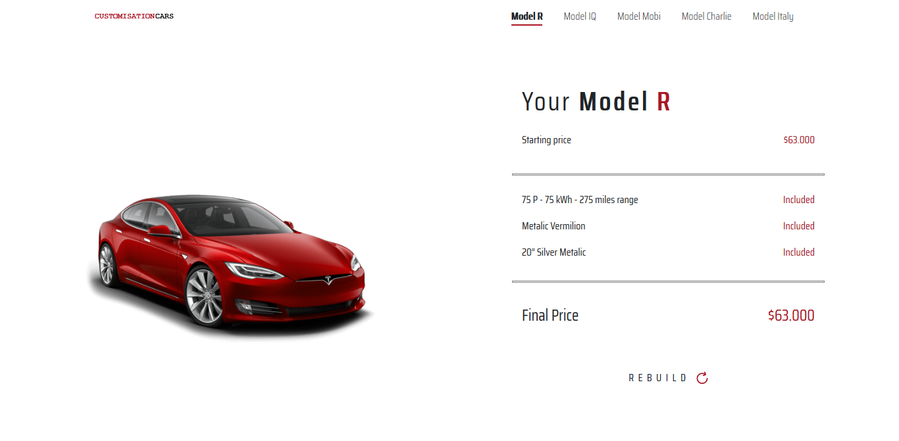

<!DOCTYPE html>
<body>
    <h1> Projeto Customization Cars </h1>
    <a href="https://gabrielribalves.github.io/Projeto-Customization-Cars/" target="_blank">Clique para ver o site</a>
    
Um site feito para o cliente ter uma customização prévia das cores, rodas, motor e preço do carro que pretende comprar

    <h3>Prints do Site</h3>
        

            
            <h4>Home</h4>
        

        

            
            <h4>Engine</h4>
        

        

            
            <h4>Color</h4>
        

        

            
            <h4>Wheels</h4>
        

        

            
            <h4>Resume</h4>
        

    <h3>Prints do Site em tela Mobile</h3>
        

            
            <h4>Home Mobile</h4>
        

        

            
            <h4>Engine Mobile</h4>
        

        

            
            <h4>Color Mobile</h4>
        

        

            
            <h4>Wheels Mobile</h4>
        

        

            
            <h4>Resume Mobile</h4>
        

</body>
</html>
